# travelkkaebi(작성중...)

 

## 소개

- #### 다른사람과 여행가고 싶은 사람들을 위한 여행멤버 구인 & 여행 정보 커뮤니티 사이트

 

## 사용기술

- `React(18)`, `JAVA(11)`, `SpringBoot(2.7.3)`, `SpringSecurity`, `MySql(8.0)`, `MyBatis`, `JPA`, `Amazon S3`, `Github`

 

## 기능설명

### `메인화면`

  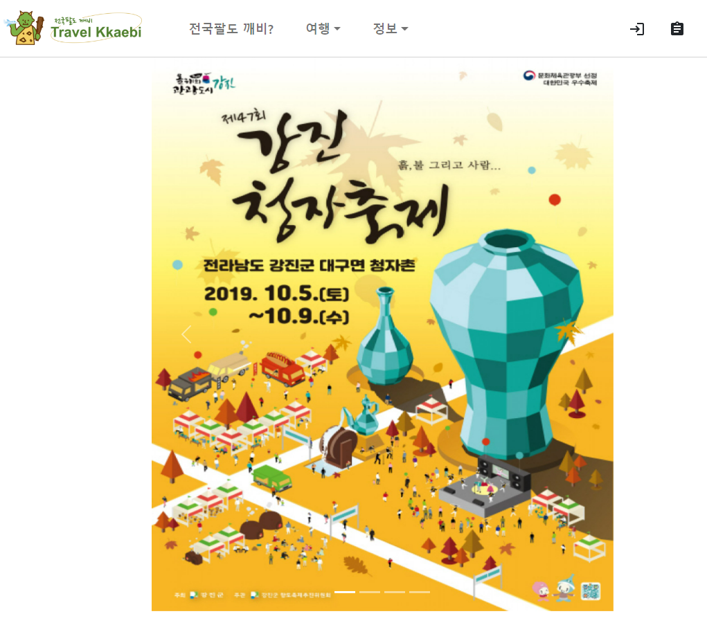
  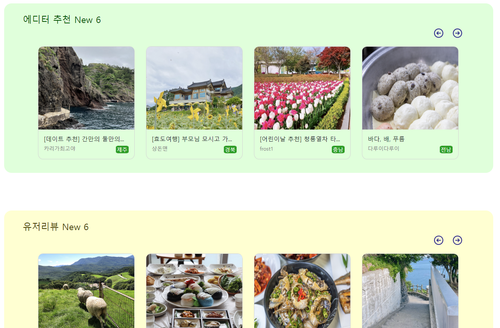

- 메인화면 상단에는 지역축제 게시판의 포스터가, 하단에는 에디터 추천 게시판과 유저리뷰 게시판의 최신 게시물들이 나타나게 구현했습니다. 위쪽 Nav바에서는 로그인, 회원가입, 로그아웃등이 가능합니다.

 

### `회원가입, 로그인`

  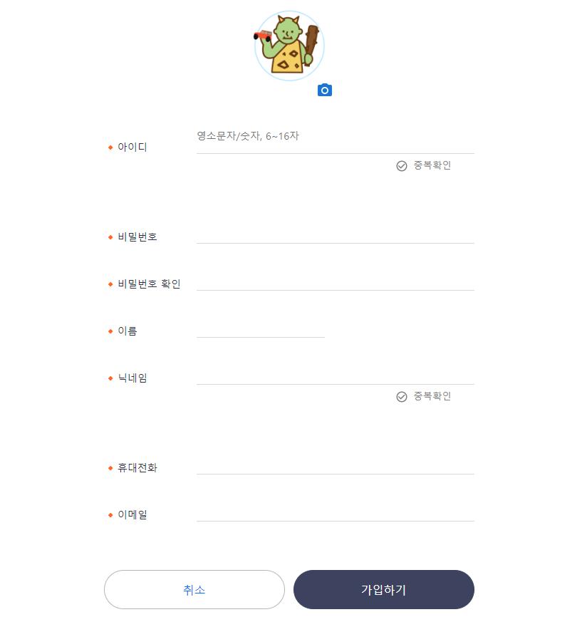
  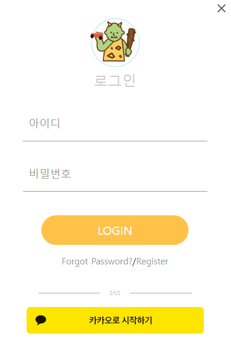
  

- 회원가입은 아이디와 닉네임 중복체크, 그리고 데이터들의 패턴을 체크하도록 구현하였습니다.<strong>(그림1)</strong>

- 로그인은 Modal 기능을 통해 구현하였습니다.<strong>(그림2)</strong>

 

### `같이가요`

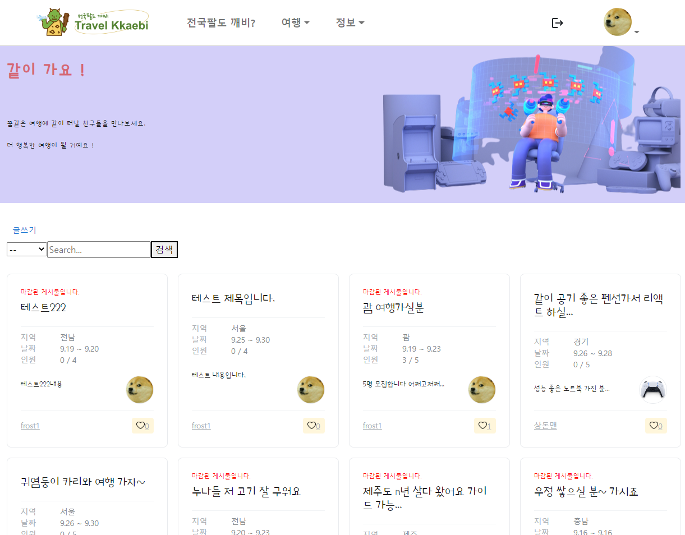
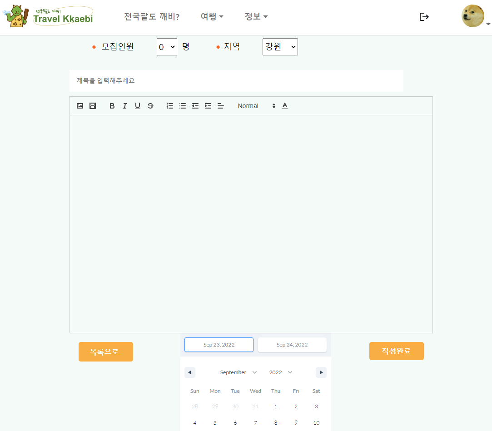
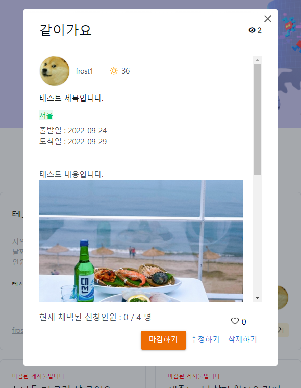

- 같이가요 게시판은 카드 형식의 리스트로 구현하였습니다.<strong>(그림1)</strong>
- 리스트 페이지에서는 지역별 혹은 제목이나 닉네임으로 검색한 결과들을 볼 수 있도록 구현하였습니다.<strong>(그림1)</strong>

- 글쓰기 페이지에서는 QuillEditor를 이용해 여러개의 이미지를 삽입할 수 있도록 구현하였고, 출발일과 도착일은 DateRange를 이용해 간편하고 직관적으로 입력할 수 있도록 구현하였습니다.<strong>(그림2)</strong>

- 상세보기 페이지는 Modal로 구현하였으며, 작성자의 매너온도 또한 볼 수 있도록 구현하였습니다.<strong>(그림3)</strong>
- 상세보기 Modal창에서 Comment를 입력해 게시물 글쓴이에게 신청서를 작성할 수 있도록 구현하였습니다.<strong>(그림3)</strong>

 

### `데려가요`

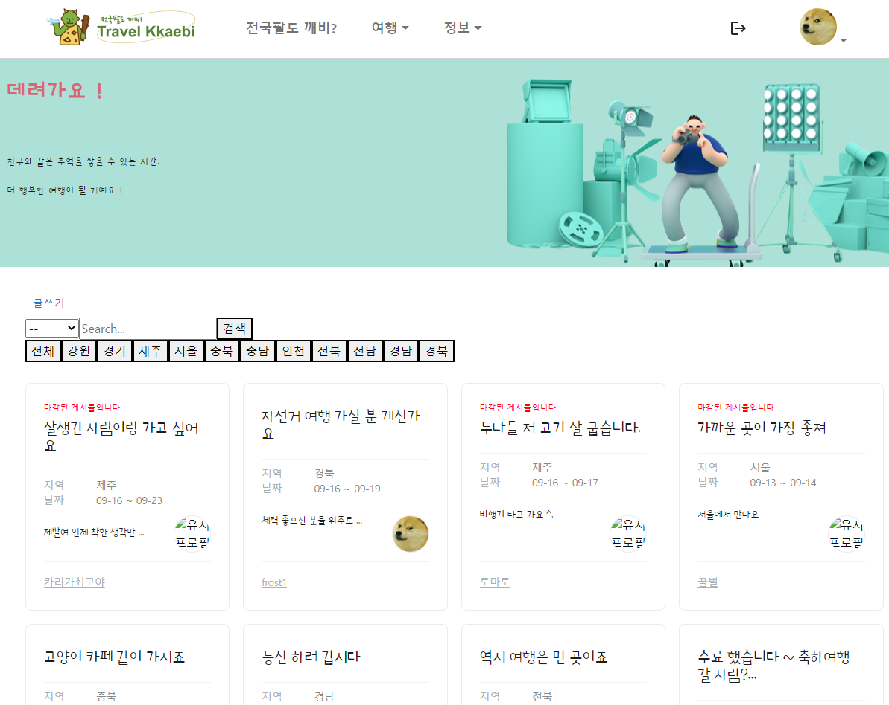
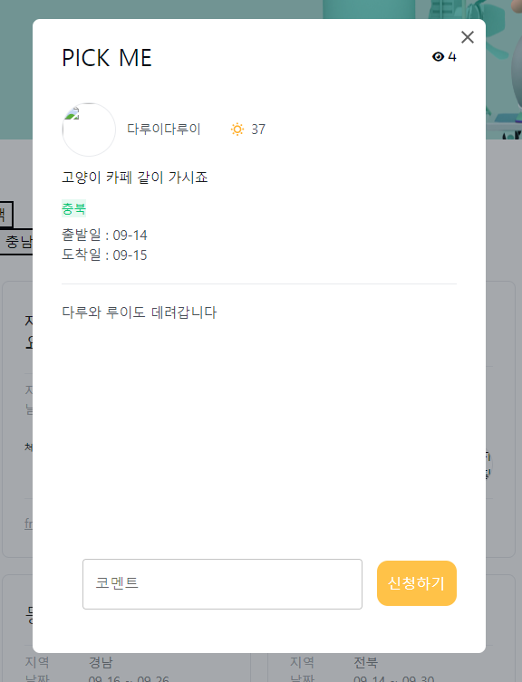

- 데려가요 게시판 또한 같이가요 게시판와 유사하게 카드형식의 리스트로 구현하였습니다.<strong>(그림1)</strong>

- 상세보기 페이지, 글쓰기 페이지도 같이가요 게시판과 유사한 구조를 가지고 있으며, 데려가요 게시판 상세보기에서 글 작성자에게 Comment를 입력해 신청서를 작성할 수 있도록 구현하였습니다.<strong>(그림2)</strong>

 

### `내 여행`

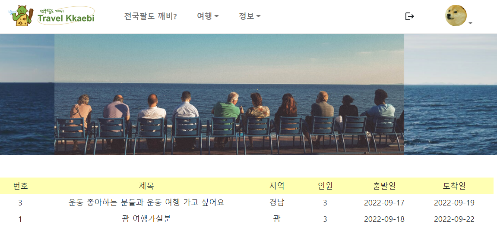
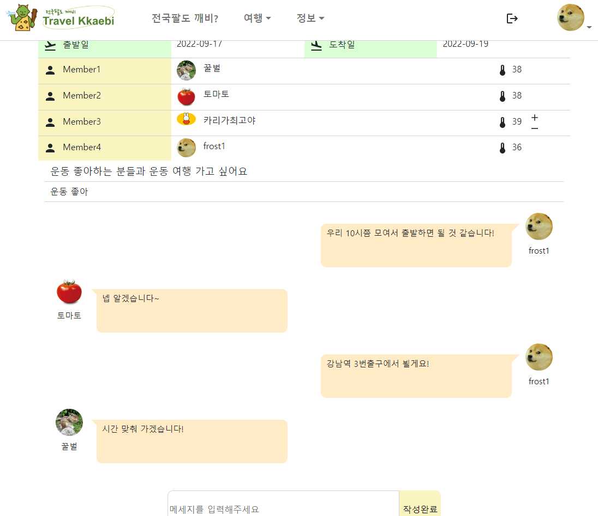

- '내 여행'에는 '같이가요'게시물이 마감 되었을 때, 채택된 인원+글쓴이가 볼 수 있는 게시물이 생성됩니다.<strong>(그림1)</strong>

- 상세보기에서는 해당 인원들이 댓글 기능을 통해 구체적인 약속을 잡거나 대화를 할 수 있습니다.<strong>(그림2)</strong>

- 상세보기에서 다른 인원의 매너온도를 증감(+1, -1)할 수 있습니다.<strong>(그림2)</strong>

### `정보게시판`

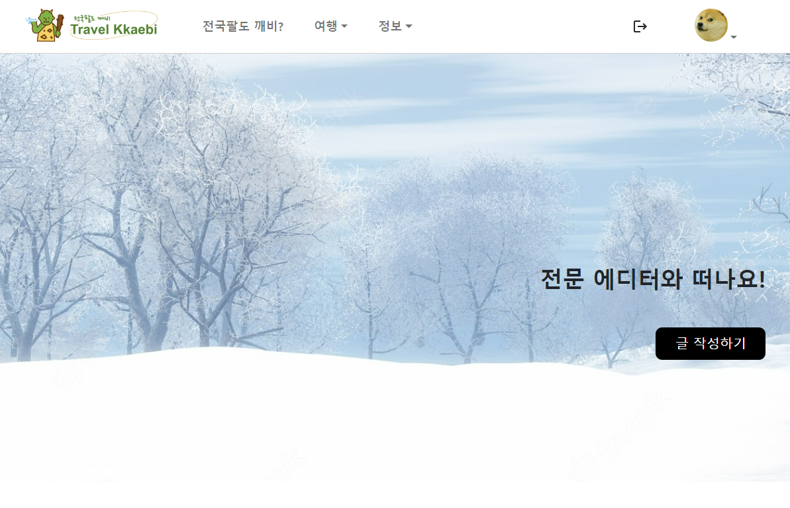
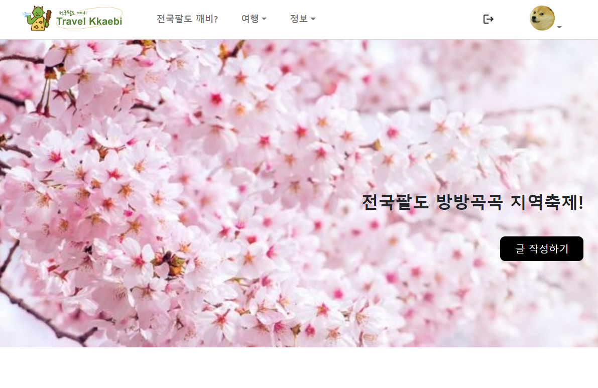
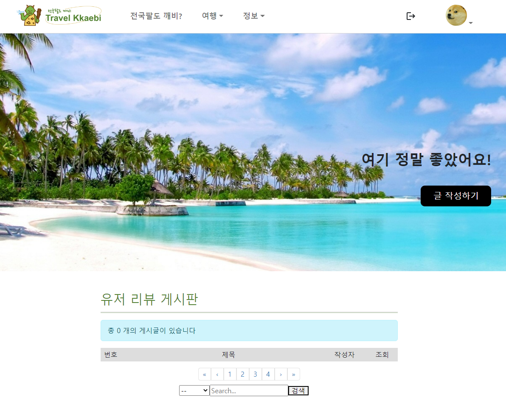

- 정보게시판에는 3가지 게시판이 있으며, 각각 1.에디터 추천 2.지역 축제 3.유저리뷰 게시판 입니다.<strong>(그림1, 2, 3)</strong>

### `마이페이지`

### `내가 쓴 신청서`

### `나에게 온 신청서`
